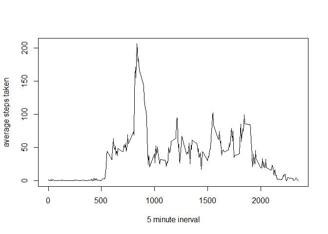

## Loading and preprocessing the data

The following code downloads the data from the internet and loads it into a dataframe and creates a new dataframe with all NA records removed. 

```r
temp <- tempfile()
download.file("https://d396qusza40orc.cloudfront.net/repdata%2Fdata%2Factivity.zip",temp)
t <- read.table(unz(temp, "activity.csv"),,header = TRUE, sep=",")
unlink(temp)

t1<- t[!(is.na(t$steps)),]
```


## What is mean total number of steps taken per day?
Use the aggregate function to calculate the total steps taken per day

```r
tsum<- aggregate(t1[,1],list(t1$date), sum)
```

Plot the values on a histogram

```r
hist(tsum$x, xlab="Steps Taken Bucket", main="Steps Taken by day Histogram")
```

<!-- -->

Take the mean

```r
mean(tsum$x)
```

```
## [1] 10766.19
```

Take the median

```r
median(tsum$x)
```

```
## [1] 10765
```


## What is the average daily activity pattern?
Take an average over each time interval and plot it on a time series chat

```r
tsum2<- aggregate(t1[,1],list(t1$interval), mean)
plot(x=tsum2$Group.1,y=tsum2$x, type="l", xlab="5 minute inerval", ylab="average steps taken")
```

<!-- -->


calculate the time interval with the maximum value 


```r
tsum2[order(tsum2[,2], decreasing= TRUE)[1],1]
```

```
## [1] 835
```


## Imputing missing values
Number of records with missing step values

```r
tNA<- t[(is.na(t$steps)),]

nrow(tNA)
```

```
## [1] 2304
```

Impute new values using k nearest neighbors imputation


```r
library(DMwR)
```

```
## Warning: package 'DMwR' was built under R version 3.4.4
```

```
## Loading required package: lattice
```

```
## Loading required package: grid
```

```r
tmiss<- knnImputation(t)
```

Aggregate data and plot original histogram vs histogram with impute values

```r
tsum3<- aggregate(tmiss[,1],list(tmiss$date), sum)

par(mfrow=(c(1,2)))
hist(tsum3$x,xlab="Steps Taken Bucket", main="Steps taken missing values corrected")
hist(tsum$x,xlab="Steps Taken Bucket", main= "Steps taken original dataset")
```

<!-- -->

```r
par(mfrow=(c(1,1)))
```

Mean comparison (1st value is new dataset , second is original)

```r
mean(tsum3$x)
```

```
## [1] 10637.85
```

```r
mean(tsum$x)
```

```
## [1] 10766.19
```

Median comparison (1st value is new dataset , second is original)

```r
median(tsum3$x)
```

```
## [1] 10600
```

```r
median(tsum$x)
```

```
## [1] 10765
```


The histograms look nearly identical, but looking at both the mean and median the missing value dataset has a slightly lower mean and median. 

## Are there differences in activity patterns between weekdays and weekends?
create dataset with weekend factor added


```r
myfunc<- function(x) if(weekdays(as.Date(x))=="Monday" | weekdays(as.Date(x))=="Tuesday" | weekdays(as.Date(x))=="Wednesday" | weekdays(as.Date(x))=="Thursday" | weekdays(as.Date(x))=="Friday"){"Weekday"}else{"Weekend"}
weekendflag<- sapply(tmiss$date, myfunc )
tmiss2<- data.frame(tmiss, factor(weekendflag))
```

Panel plot showing average steps taken over time intervals with seperate plots for weekdays and weekends


```r
tsum4<- aggregate(tmiss2[,1],list(tmiss2$interval, tmiss2$factor.weekendflag.), mean)
xyplot(tsum4$x ~ tsum4$Group.1   | tsum4$Group.2, type="l", layout=c(1,2))
```

<!-- -->


